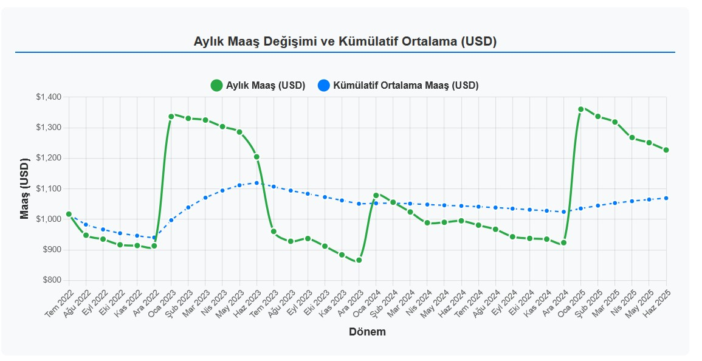
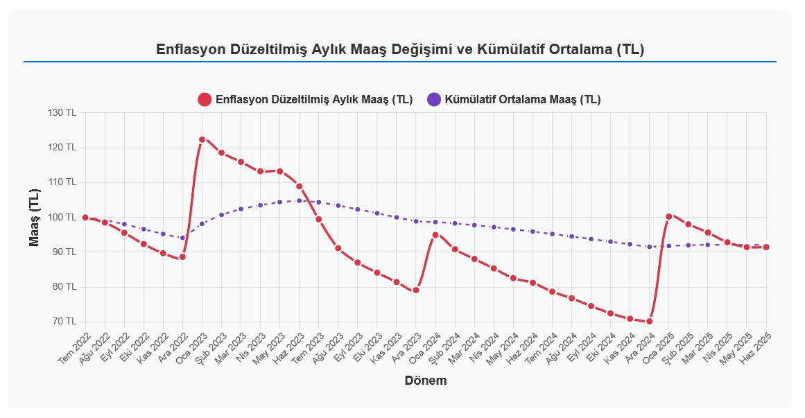

## MAAŞ Hesapla v0.93
**Amaç:** Patron sizi ne kadar kazıklıyor bunu görüp moraliniz bozulsun diye yazılmış kod. 

Döviz kur verisini TCMB den otomatik çeker. API key falan istemez. 

*maas.json* dosyasını elle güncellemeniz gerekli. 
hangi format veri girileceğini anlamanız için dummy data girdim.

> "2023"	 : 25555,
  "2023-03"	 : 26666,
  "2023-08"	 : 27777,
  "2024"	 : 25555,

türünden veri girerek sene içindeki zamları tanımlayabilirsiniz. 
her ayın verisini tek tek girmeye gerek yok. kırılım noktaları yeterli. 

Şu anda *tuik-aylik.json* dosyası elle girilmek zorunda 
Kodun bir sonraki geliştirmesinde API ile çektirmek mümkün. 
veriyi şu adresten alabilirsiniz: https://legalbank.net/belge/enflasyon-oranlari-tefe-ufe-tufe-oranlari/3225950

**Neden TÜİK?** 
Tüik verilerinin makyajlı olduğunun farkında değil miyim?
Farkındayım siz o veriyi istediğiniz şeyle (enag vb) değiştirmekte özgürsünüz

Dummy data ile oluşturulmuş ekran görüntüleri

Kodu çalıştırdınız ve moraliniz mi bozuldu? O zaman gidin bir sendikaya üye olun. Çöpçü şu kadar alıyor ben niye bu kadar alıyorum diye cakcak etmeyin. 
Örgütsüz olduğunuz sürece sömürülmeye mahkumsunuz!

### CHANGELOG

0.93 (2025-06-16)
değişken isimleri tutarlı hale getirildi.

0.92 (2025-06-15)
İlk yayınlanış. 
