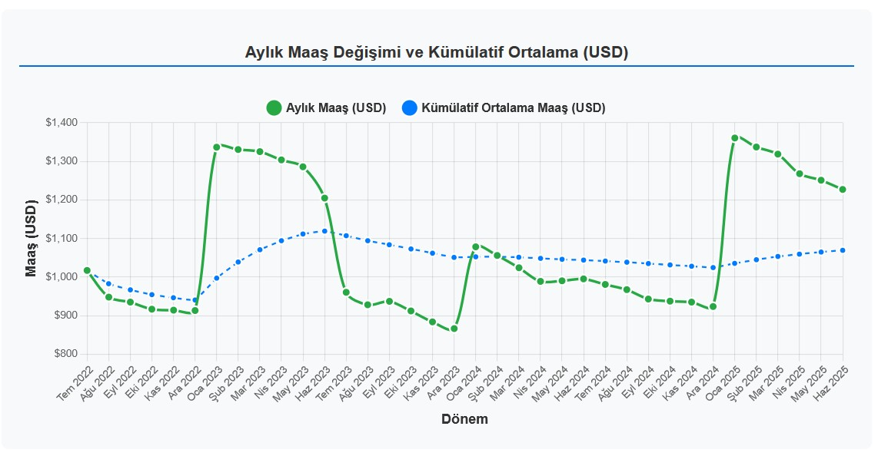
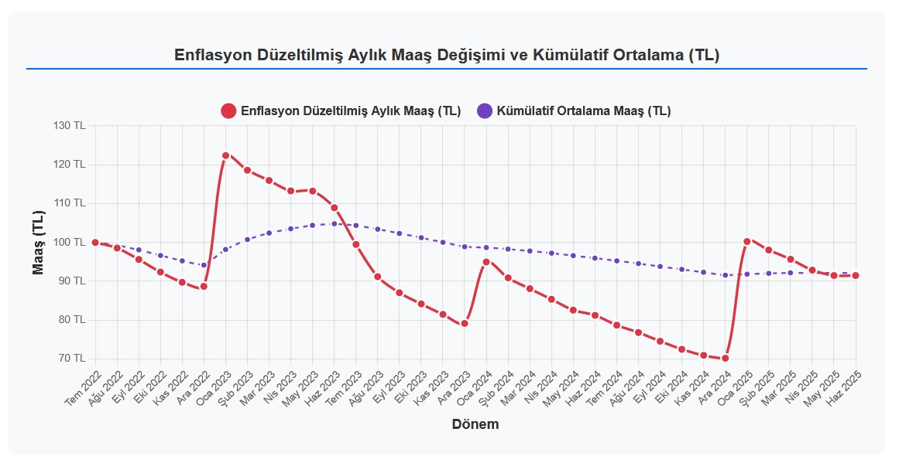

## MAAŞ Hesapla v0.92
**Amaç:** Patron sizi ne kadar kazıklıyor bunu görüp moraliniz bozulsun diye yazılmış kod. 

Döviz kur verisini TCMB den otomatik çeker. API key falan istemez. 

## Gereksinimler
- **PHP 8.0+** (`str_starts_with` ve null coalescing `??` operatörü gerektirir)
- PHP eklentileri: `curl` (TCMB/EVDS isteği), `simplexml` (TCMB XML ayrıştırma), `json`

*maas.example.json* dosyasını *maas.json* olarak kopyalayıp kendi maaş verinizle güncelleyin. 
Örnek dosyaya hangi format veri girileceğini anlamanız için dummy data girdim. 
*maas.json* kişisel veridir; .gitignore ile repoya girmez.

> "2023"	 : 25555,
  "2023-03"	 : 26666,
  "2023-08"	 : 27777,
  "2024"	 : 25555,

türünden veri girerek sene içindeki zamları tanımlayabilirsiniz. 
her ayın verisini tek tek girmeye gerek yok. kırılım noktaları yeterli. 

*tuik-aylik.json* dosyası artık TCMB EVDS üzerinden otomatik güncelleniyor (resmi TÜFE Genel Endeks, aylık % değişim). 
Bunun için ücretsiz bir EVDS API anahtarı gerekir: https://evds3.tcmb.gov.tr -> Profilim -> API Key Kopyala 
*config.example.php* dosyasını *config.php* olarak kopyalayıp anahtarınızı girin. Anahtar girmezseniz dosya eskisi gibi elle kullanılır.

**Neden config.php?** API anahtarı kişiseldir; *config.php* .gitignore ile repoya girmez.

**Neden TÜİK?** 
Tüik verilerinin makyajlı olduğunun farkında değil miyim?
Farkındayım siz o veriyi istediğiniz şeyle (enag vb) değiştirmekte özgürsünüz

Dummy data ile oluşturulmuş ekran görüntüleri

Kodu çalıştırdınız moraliniz mi bozuldu? O zaman gidin bir sendikaya üye olun. Çöpçü şu kadar alıyor ben niye bu kadar alıyorum diye cakcak etmeyin. Örgütsüz olduğun sürece sömürülmeye mahkumsun!

